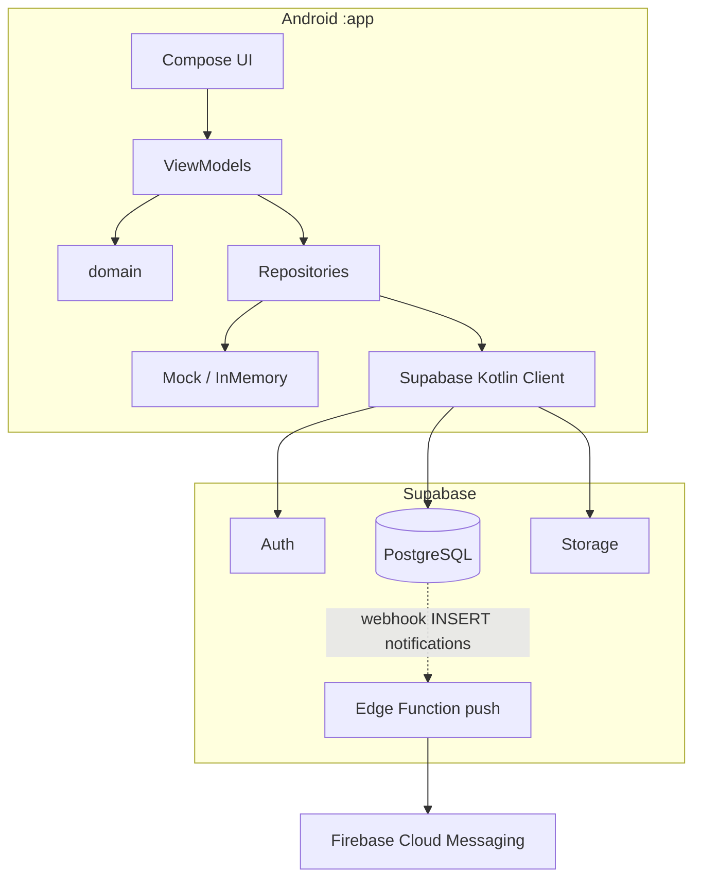

# LEOVER — Arquitectura inicial (estado real)

**Fecha:** 2026-07-14  
**Estado:** Vigente (actualizado M00 Etapa 4)  
**Alcance:** describe el sistema tras el cierre de M00.  
**No incluye:** NestJS, Docker Compose, Prisma/TypeORM, API REST propia ni segunda base de datos.

Documentos relacionados:

- [M00-auditoria-inicial.md](M00-auditoria-inicial.md)
- [ADR-0001 Supabase](../adr/ADR-0001-Supabase-como-backend-principal.md)
- [D01](../01-producto/D01-Modulos-y-Orden.md)

---

## 1. Vista general

Leover se ejecuta hoy como:

1. **APP Android** — módulo Gradle único `:app` (`com.comunidapp.app`).
2. **Backend principal Supabase** — Auth, PostgreSQL, Storage, Realtime, Edge Functions.
3. **Push** — Firebase Cloud Messaging (solo mensajería).
4. **Modo mock** — datos en memoria si no hay `SUPABASE_URL` / `SUPABASE_ANON_KEY` en `local.properties`.

No existen superficies WEB / ORG / PRO / ADMIN como proyectos separados; roles y pantallas viven dentro de la misma app.

---

## 2. Aplicación Android

| Aspecto | Implementación |
|---------|----------------|
| Lenguaje UI | Kotlin + Jetpack Compose + Material 3 |
| Arquitectura UI | MVVM (`viewmodel/`) + estado unidireccional vía `StateFlow` / `collectAsState` |
| Navegación | Navigation Compose (`navigation/ComunidappNavGraph.kt`, `NavRoutes.kt`) |
| Tema | Claro / oscuro (`ui/theme/Theme.kt`) |
| Imágenes | Coil |
| Ubicación | Play Services Location (alertas GPS) |
| Empaquetado | `namespace` / `applicationId`: `com.comunidapp.app` (migración de marca documentada en ADR-0006) |

### Capas

```text
ui/ (screens, components, theme)
        ↓ observa
viewmodel/
        ↓ usa
domain/ (permisos, privacidad, módulos)
core/ (config, featureflags, logging, result)  ← AppConfigProvider
        ↓
data/repository (interfaces)  ←────────── DataProvider / AuthProvider
        ↓                           ↓
   data/mock                 data/remote/supabase + storage
```

**Límites:**

- **UI** no debe llamar a Supabase/Ktor directamente ni leer `BuildConfig`/`local.properties`.
- **ViewModels** dependen de repositorios e interfaces, no de datasources.
- **Domain** contiene reglas de producto (permisos, privacidad), no I/O.
- **core/** concentra configuración tipada, flags, logger y errores comunes para código nuevo.
- **Data** traduce filas remotas ↔ modelos de dominio.

---

## 3. Flujo de datos

1. `AppConfigProvider` resuelve ambiente, mock/remoto y flags a partir de `BuildConfig` (credenciales inválidas → mock seguro).
2. `AuthProvider` / `DataProvider` eligen Supabase o mock según `AppConfigProvider.featureFlags().useSupabase`.
3. ViewModels observan `Flow`/`StateFlow` y emiten UiState.
4. Pantallas Compose pueden usar estados comunes en `ui/components/state/` (`LoadingState`, `EmptyState`, `ErrorState` + retry). El wrapper legacy `ui/components/LoadingState` delega al foundation.

### Fundación de plataforma (M00 Etapa 4)

| Pieza | Ubicación |
|-------|-----------|
| AppConfig | `core/config/` |
| FeatureFlags | `core/featureflags/` (pagos/mapas experimentales OFF por defecto) |
| AppLogger | `core/logging/` (sanitiza tokens, email, coords; release reducido) |
| AppResult / AppError | `core/result/` (para código nuevo; sin migración masiva) |
| Network Security Config | `res/xml/network_security_config.xml` (cleartext OFF) |

---

## 4. Backend: Supabase

| Servicio | Uso actual |
|----------|------------|
| Auth | Registro, login, sesión, deep link `com.comunidapp.app://login-callback` |
| Postgres | Tablas de producto vía migraciones `supabase/migrations/` (001–013) |
| Storage | Bucket `leover` (imágenes) |
| Realtime / polling | Observación de feeds y entidades (patrón polling en varios datasources) |
| Edge Functions | `supabase/functions/push` — envío FCM ante insert en `notifications` |

La **fuente de verdad** de datos remotos es Postgres de Supabase + políticas RLS donde correspondan.

---

## 5. Firebase

- **En uso:** Cloud Messaging (`firebase-messaging`, `LeoverFirebaseMessagingService`, `google-services.json`).
- **No en uso como backend de datos:** Firestore / Firebase Storage (código Kotlin de Firestore ausente; reglas en raíz son legado — ver inventario).

---

## 6. Inyección de dependencias

- Service locator: `DataProvider`, `AuthProvider`.
- ViewModels con parámetros default a esos proveedores.
- Hilt **no** está integrado (decisión: ADR-0003).

---

## 7. Acceso a red

- Cliente principal: **Supabase Kotlin** (sobre Ktor).
- Ktor Android en el classpath por el SDK Supabase; no hay Retrofit.
- No existe API REST propia `/api/v1` en este repositorio.

---

## 8. Diagrama



---

## 9. Riesgos actuales

1. Lint debug en verde (0 errors); warnings residuales documentados en `04-calidad/`.
2. Paquete `com.comunidapp.app` vs marca Leover (ADR-0006; sin renombre aún).
3. Documentación legacy Firebase mezcla con setup real Supabase.
4. Secretos: `local.properties` OK; `google-services.json` versionado (repo privado).
5. Observabilidad base lista (`AppLogger`); Crashlytics/Sentry fuera de M00 (M07).

---

## 10. Qué no es esta arquitectura

No forma parte del sistema actual (ni de M00 tras corrección Etapa 2):

- Servidor NestJS
- Docker Compose / PostGIS local obligatorio
- Prisma / TypeORM
- Microservicios
- Portales WEB/ORG/PRO/ADMIN independientes
