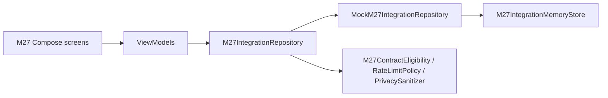

# M27 — Arquitectura (Bloque 1)

- Entrada desde Comunidad → hub M27 con subpantallas.
- `DataProvider.m27IntegrationRepository` usa mock determinista en Bloque 1.
- Bloque 2 agregará `SupabaseM27IntegrationRepository` y migración 075 (sin aplicar).
