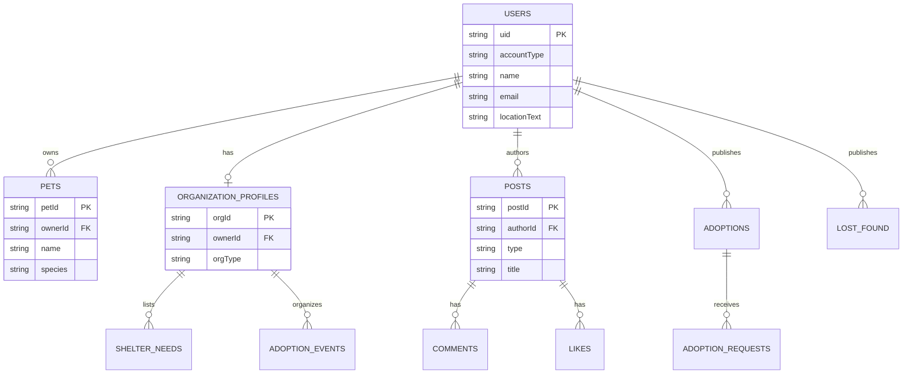

# Leover — Modelo de Datos Firestore

**Versión:** 1.0  
**Fecha:** Julio 2026  
**Relacionado con:** [`leover-requirements.md`](leover-requirements.md), [`leover-phase0-implementation.md`](leover-phase0-implementation.md)

---

## 1. Principios de diseño

| Principio | Decisión |
|-----------|----------|
| **ID canónico** | `users/{uid}` usa el UID de Firebase Auth |
| **Desnormalización controlada** | Nombre/foto del autor en posts para evitar N+1 en feed |
| **Subcolecciones** | Solo para datos acotados al padre (comentarios, likes, necesidades) |
| **Colecciones raíz** | Entidades consultables globalmente (posts, adopciones, eventos) |
| **Timestamps** | `createdAt`, `updatedAt` como `Timestamp` en Firestore; `date` display en cliente |
| **Enums** | Strings (`"DOG"`, `"AVAILABLE"`) para compatibilidad y queries |
| **Ubicación v1** | `locationText` (ciudad/barrio); `geo` (lat/lng) opcional en Fase 2 |
| **Imágenes** | URLs de Firebase Storage; nunca bytes en Firestore |

---

## 2. Diagrama de colecciones



---

## 3. Firebase Storage

### 3.1 Estructura de paths

```
/users/{uid}/avatar.jpg
/users/{uid}/pets/{petId}/photo.jpg
/posts/{postId}/image.jpg
/adoptions/{adoptionId}/photo.jpg
/lost_found/{postId}/photo.jpg
/organizations/{orgId}/logo.jpg
/events/{eventId}/cover.jpg
```

### 3.2 Reglas (borrador)

- Lectura: autenticados
- Escritura: solo el dueño del path (`request.auth.uid == uid` en segmento correspondiente)
- Tamaño máximo recomendado: 5 MB por imagen
- Formatos: JPEG, PNG, WebP

---

## 4. Colección: `users`

**Path:** `users/{uid}`  
**Document ID:** Firebase Auth UID

### 4.1 Campos

| Campo | Tipo | Requerido | Descripción |
|-------|------|-----------|-------------|
| `id` | string | ✓ | Igual a `uid` |
| `email` | string | ✓ | Email normalizado |
| `name` | string | ✓ | Nombre visible |
| `accountType` | string | ✓ | Ver §4.2 |
| `profileImageUrl` | string | | URL Storage avatar |
| `bio` | string | | Biografía |
| `locationText` | string | | Ciudad/barrio (ej. "Palermo, CABA") |
| `phone` | string | | Privado; no exponer en queries públicas |
| `phonePublic` | boolean | | Si `true`, visible en perfil público |
| `emailVerified` | boolean | ✓ | Sincronizado con Auth |
| `fosterHomeActive` | boolean | | Solo `PERSON`: ofrece tránsito |
| `createdAt` | timestamp | ✓ | |
| `updatedAt` | timestamp | ✓ | |

### 4.2 `accountType` (enum string)

```
PERSON | SHELTER | VET | TRAINER | WALKER | SHOP | FOSTER_HOME
```

### 4.3 Índices compuestos

| Colección | Campos | Uso |
|-----------|--------|-----|
| `users` | `locationText` ASC, `createdAt` DESC | Personas cerca (US-RS05) |
| `users` | `accountType` ASC, `locationText` ASC | Directorios por tipo |

### 4.4 Mapeo Kotlin (evolución de `User.kt`)

```kotlin
data class User(
    val id: String,
    val email: String,
    val name: String,
    val accountType: AccountType = AccountType.PERSON,
    val profileImageUrl: String? = null,
    val bio: String? = null,
    val locationText: String? = null,
    val phone: String? = null,
    val phonePublic: Boolean = false,
    val emailVerified: Boolean = false,
    val fosterHomeActive: Boolean = false,
    val createdAt: Long? = null,
    val updatedAt: Long? = null
)
```

---

## 5. Colección: `pets`

**Path:** `pets/{petId}`  
**Document ID:** Auto-generado

### 5.1 Campos

| Campo | Tipo | Requerido | Descripción |
|-------|------|-----------|-------------|
| `id` | string | ✓ | |
| `ownerId` | string | ✓ | `users/{uid}` |
| `name` | string | ✓ | |
| `photoUrl` | string | | |
| `species` | string | ✓ | `DOG`, `CAT`, `OTHER` |
| `sex` | string | ✓ | `MALE`, `FEMALE`, `UNKNOWN` |
| `ageYears` | number | ✓ | |
| `ageMonths` | number | | Default 0 |
| `size` | string | ✓ | `SMALL`, `MEDIUM`, `LARGE` |
| `description` | string | ✓ | |
| `vaccinations` | array\<map\> | | `{ name, date, nextDueDate? }` |
| `lastDeworming` | string | | Fecha display |
| `lastFleaTreatment` | string | | |
| `reminders` | array\<map\> | | `{ id, title, date, type }` |
| `createdAt` | timestamp | ✓ | |
| `updatedAt` | timestamp | ✓ | |

### 5.2 Índices

| Campos | Uso |
|--------|-----|
| `ownerId` ASC, `createdAt` DESC | Mis mascotas |

### 5.3 Reglas de acceso

- **Read:** autenticados (perfil público del dueño puede restringir en Fase 2)
- **Create/Update/Delete:** `request.auth.uid == resource.data.ownerId`

---

## 6. Colección: `posts`

**Path:** `posts/{postId}`  
Feed de red social y publicaciones cross-módulo.

### 6.1 Campos

| Campo | Tipo | Requerido | Descripción |
|-------|------|-----------|-------------|
| `id` | string | ✓ | |
| `authorId` | string | ✓ | |
| `authorName` | string | ✓ | Desnormalizado |
| `authorImageUrl` | string | | Desnormalizado |
| `type` | string | ✓ | `GENERAL`, `QUESTION`, `URGENT`, `ADOPTION`, `LOST_FOUND` |
| `title` | string | ✓ | |
| `content` | string | ✓ | |
| `imageUrl` | string | | |
| `locationText` | string | | |
| `likeCount` | number | ✓ | Contador; default 0 |
| `commentCount` | number | ✓ | Contador; default 0 |
| `createdAt` | timestamp | ✓ | Orden del feed |
| `updatedAt` | timestamp | ✓ | |

### 6.2 Subcolección: `posts/{postId}/comments`

| Campo | Tipo | Requerido |
|-------|------|-----------|
| `id` | string | ✓ |
| `authorId` | string | ✓ |
| `authorName` | string | ✓ |
| `authorImageUrl` | string | |
| `content` | string | ✓ |
| `createdAt` | timestamp | ✓ |

### 6.3 Subcolección: `posts/{postId}/likes`

**Document ID:** `{uid}` del usuario que dio like

| Campo | Tipo |
|-------|------|
| `userId` | string |
| `createdAt` | timestamp |

> Un documento por like simplifica toggle y evita duplicados.

### 6.4 Índices

| Campos | Uso |
|--------|-----|
| `createdAt` DESC | Feed global |
| `type` ASC, `createdAt` DESC | Filtro por tipo |
| `locationText` ASC, `createdAt` DESC | Cerca de mí |
| `authorId` ASC, `createdAt` DESC | Publicaciones del perfil |

### 6.5 Mapeo Kotlin (evolución de `FeedPost.kt`)

```kotlin
data class FeedPost(
    val id: String,
    val authorId: String,
    val authorName: String,
    val authorImageUrl: String? = null,
    val type: PostType,
    val title: String,
    val content: String,
    val imageUrl: String? = null,
    val locationText: String? = null,
    val likeCount: Int = 0,
    val commentCount: Int = 0,
    val createdAt: Long? = null,
    // Campo derivado en UI:
    val date: String = "" // formateado desde createdAt
)
```

---

## 7. Colección: `adoptions`

**Path:** `adoptions/{adoptionId}`

### 7.1 Campos

| Campo | Tipo | Requerido | Descripción |
|-------|------|-----------|-------------|
| `id` | string | ✓ | |
| `publisherId` | string | ✓ | Usuario o refugio (uid) |
| `publisherName` | string | ✓ | Desnormalizado |
| `organizationId` | string | | Si publica un refugio vinculado |
| `name` | string | ✓ | Nombre de la mascota |
| `photoUrl` | string | | |
| `species` | string | ✓ | |
| `sex` | string | ✓ | |
| `ageYears` | number | ✓ | |
| `ageMonths` | number | | |
| `size` | string | ✓ | |
| `locationText` | string | ✓ | |
| `description` | string | ✓ | |
| `status` | string | ✓ | `AVAILABLE`, `IN_PROCESS`, `ADOPTED` |
| `createdAt` | timestamp | ✓ | |
| `updatedAt` | timestamp | ✓ | |

### 7.2 Subcolección: `adoptions/{adoptionId}/requests`

| Campo | Tipo | Requerido |
|-------|------|-----------|
| `id` | string | ✓ |
| `requesterId` | string | ✓ |
| `requesterName` | string | ✓ |
| `message` | string | ✓ |
| `contactPhone` | string | |
| `contactEmail` | string | |
| `status` | string | ✓ | `PENDING`, `ACCEPTED`, `REJECTED` |
| `createdAt` | timestamp | ✓ |

### 7.3 Índices

| Campos | Uso |
|--------|-----|
| `status` ASC, `createdAt` DESC | Listado default (disponibles) |
| `locationText` ASC, `status` ASC, `createdAt` DESC | Filtros |
| `species` ASC, `status` ASC | Filtro especie |
| `publisherId` ASC, `createdAt` DESC | Adopciones del refugio |

---

## 8. Colección: `lost_found`

**Path:** `lost_found/{postId}`

### 8.1 Campos

| Campo | Tipo | Requerido |
|-------|------|-----------|
| `id` | string | ✓ |
| `authorId` | string | ✓ |
| `authorName` | string | ✓ |
| `type` | string | ✓ | `LOST`, `FOUND` |
| `status` | string | ✓ | `ACTIVE`, `RESOLVED` |
| `petName` | string | | |
| `species` | string | ✓ |
| `photoUrl` | string | | |
| `locationText` | string | ✓ |
| `description` | string | ✓ |
| `contactInfo` | string | ✓ |
| `geo` | geopoint | | Fase 2 / mapa |
| `createdAt` | timestamp | ✓ |
| `updatedAt` | timestamp | ✓ |
| `resolvedAt` | timestamp | | |

### 8.2 Índices

| Campos | Uso |
|--------|-----|
| `status` ASC, `createdAt` DESC | Listado activos |
| `type` ASC, `status` ASC, `createdAt` DESC | Filtros |
| `locationText` ASC, `status` ASC | Por zona |

---

## 9. Colección: `organizations`

Perfiles extendidos para refugios, vets, tiendas, etc.  
**Path:** `organizations/{orgId}`  
**Document ID:** Auto-generado; vinculado a `users/{uid}` vía `ownerId`.

### 9.1 Campos comunes

| Campo | Tipo | Requerido |
|-------|------|-----------|
| `id` | string | ✓ |
| `ownerId` | string | ✓ | UID del usuario administrador |
| `orgType` | string | ✓ | `SHELTER`, `VET`, `TRAINER`, `WALKER`, `SHOP` |
| `name` | string | ✓ |
| `photoUrl` | string | |
| `description` | string | ✓ |
| `locationText` | string | ✓ |
| `address` | string | | |
| `contactPhone` | string | |
| `contactEmail` | string | |
| `website` | string | |
| `verified` | boolean | ✓ | Default false |
| `createdAt` | timestamp | ✓ |
| `updatedAt` | timestamp | ✓ |

### 9.2 Campos por tipo (map `metadata`)

```json
// SHELTER
{ "needsCount": 3 }

// VET
{ "services": ["consulta", "vacunas", "cirugía"], "hours": "Lun-Vie 9-18" }

// TRAINER
{ "specialties": ["cachorros", "ansiedad"], "modality": "presencial" }

// WALKER
{ "serviceArea": "Palermo, Recoleta", "availability": "Lun-Vie 8-12" }

// SHOP
{ "category": "alimentos", "highlights": ["premium", "natural"] }
```

### 9.3 Subcolección: `organizations/{orgId}/needs`

| Campo | Tipo |
|-------|------|
| `id` | string |
| `item` | string |
| `quantity` | string |
| `priority` | string | `LOW`, `MEDIUM`, `HIGH` |
| `updatedAt` | timestamp |

### 9.4 Índices

| Campos | Uso |
|--------|-----|
| `orgType` ASC, `locationText` ASC | Directorios |
| `ownerId` ASC | Mi organización |

---

## 10. Colección: `foster_homes`

**Path:** `foster_homes/{fosterId}`  
Alternativa: flag en `users` + subdocumento. Colección separada facilita queries.

| Campo | Tipo | Requerido |
|-------|------|-----------|
| `id` | string | ✓ |
| `userId` | string | ✓ |
| `userName` | string | ✓ |
| `locationText` | string | ✓ |
| `capacity` | number | ✓ |
| `speciesAccepted` | array\<string\> | ✓ |
| `notes` | string | |
| `available` | boolean | ✓ |
| `createdAt` | timestamp | ✓ |
| `updatedAt` | timestamp | ✓ |

---

## 11. Colección: `events`

**Path:** `events/{eventId}`

| Campo | Tipo | Requerido |
|-------|------|-----------|
| `id` | string | ✓ |
| `organizerId` | string | ✓ |
| `organizerName` | string | ✓ |
| `organizationId` | string | |
| `title` | string | ✓ |
| `description` | string | ✓ |
| `coverImageUrl` | string | |
| `locationText` | string | ✓ |
| `address` | string | |
| `startsAt` | timestamp | ✓ |
| `endsAt` | timestamp | |
| `status` | string | ✓ | `UPCOMING`, `FINISHED`, `CANCELLED` |
| `createdAt` | timestamp | ✓ |
| `updatedAt` | timestamp | ✓ |

**Índice:** `status` ASC, `startsAt` ASC

---

## 12. Colección: `donations`

Campañas y oportunidades de voluntariado.

**Path:** `donations/{donationId}`

| Campo | Tipo | Requerido |
|-------|------|-----------|
| `id` | string | ✓ |
| `type` | string | ✓ | `CAMPAIGN`, `VOLUNTEER` |
| `organizationId` | string | ✓ |
| `organizationName` | string | ✓ |
| `title` | string | ✓ |
| `description` | string | ✓ |
| `items` | array\<map\> | | `{ item, quantity }` |
| `locationText` | string | |
| `deadline` | timestamp | |
| `status` | string | ✓ | `OPEN`, `CLOSED` |
| `createdAt` | timestamp | ✓ |

---

## 13. Reglas de seguridad Firestore (borrador Fase 0–1)

```javascript
rules_version = '2';
service cloud.firestore {
  match /databases/{database}/documents {

    function isAuth() {
      return request.auth != null;
    }
    function isOwner(uid) {
      return isAuth() && request.auth.uid == uid;
    }

    match /users/{userId} {
      allow read: if isAuth();
      allow create: if isOwner(userId);
      allow update: if isOwner(userId);
      allow delete: if false;
    }

    match /pets/{petId} {
      allow read: if isAuth();
      allow create: if isAuth() && request.resource.data.ownerId == request.auth.uid;
      allow update, delete: if isAuth() && resource.data.ownerId == request.auth.uid;
    }

    match /posts/{postId} {
      allow read: if isAuth();
      allow create: if isAuth() && request.resource.data.authorId == request.auth.uid;
      allow update, delete: if isAuth() && resource.data.authorId == request.auth.uid;

      match /comments/{commentId} {
        allow read: if isAuth();
        allow create: if isAuth() && request.resource.data.authorId == request.auth.uid;
        allow delete: if isAuth() && resource.data.authorId == request.auth.uid;
      }
      match /likes/{userId} {
        allow read: if isAuth();
        allow write: if isOwner(userId);
      }
    }

    match /adoptions/{adoptionId} {
      allow read: if isAuth();
      allow create: if isAuth() && request.resource.data.publisherId == request.auth.uid;
      allow update, delete: if isAuth() && resource.data.publisherId == request.auth.uid;

      match /requests/{requestId} {
        allow read: if isAuth() && (
          resource.data.requesterId == request.auth.uid ||
          get(/databases/$(database)/documents/adoptions/$(adoptionId)).data.publisherId == request.auth.uid
        );
        allow create: if isAuth() && request.resource.data.requesterId == request.auth.uid;
      }
    }

    match /lost_found/{postId} {
      allow read: if isAuth();
      allow create: if isAuth() && request.resource.data.authorId == request.auth.uid;
      allow update, delete: if isAuth() && resource.data.authorId == request.auth.uid;
    }

    match /organizations/{orgId} {
      allow read: if isAuth();
      allow create, update: if isAuth() && request.resource.data.ownerId == request.auth.uid;
      allow delete: if isAuth() && resource.data.ownerId == request.auth.uid;

      match /needs/{needId} {
        allow read: if isAuth();
        allow write: if isAuth() &&
          get(/databases/$(database)/documents/organizations/$(orgId)).data.ownerId == request.auth.uid;
      }
    }

    match /foster_homes/{fosterId} {
      allow read: if isAuth();
      allow create, update, delete: if isAuth() && request.resource.data.userId == request.auth.uid;
    }

    match /events/{eventId} {
      allow read: if isAuth();
      allow create, update, delete: if isAuth() && request.resource.data.organizerId == request.auth.uid;
    }

    match /donations/{donationId} {
      allow read: if isAuth();
      allow create, update: if isAuth();
    }
  }
}
```

> Ajustar `donations` y creación de `organizations` según validación de roles en Cloud Functions (Fase 2).

---

## 14. Capa de datos Android

### 14.1 Estructura de paquetes propuesta

```
data/
├── model/           # Data classes (existentes, extendidos)
├── remote/
│   ├── firestore/
│   │   ├── FirestoreMappers.kt      # Document ↔ Model
│   │   ├── UserFirestoreDataSource.kt
│   │   ├── PetFirestoreDataSource.kt
│   │   ├── PostFirestoreDataSource.kt
│   │   └── ...
│   └── storage/
│       └── FirebaseStorageService.kt
├── repository/
│   ├── AuthRepository.kt            # Existente
│   ├── UserRepository.kt
│   ├── FeedRepository.kt            # Interface + Firebase impl
│   └── ...
└── provider/
    └── DataProvider.kt              # Similar a AuthProvider
```

### 14.2 `DataProvider` (patrón dual mock / Firebase)

```kotlin
object DataProvider {
    val useFirebase: Boolean get() = BuildConfig.FIREBASE_ENABLED

    val userRepository: UserRepository by lazy {
        if (useFirebase) FirebaseUserRepository() else MockUserRepository()
    }
    val feedRepository: FeedRepository by lazy {
        if (useFirebase) FirebaseFeedRepository() else MockFeedRepository()
    }
    // ...
}
```

### 14.3 Mappers — convenciones

| Firestore | Kotlin |
|-----------|--------|
| `Timestamp` | `Long` (millis) o `Instant` |
| `GeoPoint` | `GeoLocation(lat, lng)` (Fase 2) |
| Enum string | `enum class` con `fromString()` |
| DocumentReference | Solo ID como `String` en modelos |

Ejemplo:

```kotlin
fun DocumentSnapshot.toFeedPost(): FeedPost? {
    if (!exists()) return null
    return FeedPost(
        id = id,
        authorId = getString("authorId") ?: return null,
        authorName = getString("authorName") ?: "",
        authorImageUrl = getString("authorImageUrl"),
        type = PostType.valueOf(getString("type") ?: "GENERAL"),
        title = getString("title") ?: "",
        content = getString("content") ?: "",
        imageUrl = getString("imageUrl"),
        locationText = getString("locationText"),
        likeCount = getLong("likeCount")?.toInt() ?: 0,
        commentCount = getLong("commentCount")?.toInt() ?: 0,
        createdAt = getTimestamp("createdAt")?.toDate()?.time
    )
}
```

---

## 15. Queries principales por pantalla

| Pantalla | Query Firestore |
|----------|-----------------|
| Home (feed) | `posts.orderBy("createdAt", DESC).limit(20)` |
| Perfil (posts) | `posts.whereEqualTo("authorId", uid).orderBy("createdAt", DESC)` |
| Adopciones | `adoptions.whereEqualTo("status", "AVAILABLE").orderBy("createdAt", DESC)` |
| Perdidos | `lost_found.whereEqualTo("status", "ACTIVE").orderBy("createdAt", DESC)` |
| Mis mascotas | `pets.whereEqualTo("ownerId", uid).orderBy("createdAt", DESC)` |
| Refugios | `organizations.whereEqualTo("orgType", "SHELTER")` |
| Personas cerca | `users.whereEqualTo("locationText", city).limit(30)` |
| Comentarios | `posts/{id}/comments.orderBy("createdAt", ASC)` |
| Like toggle | `set` / `delete` en `posts/{id}/likes/{uid}` + incremento atómico `likeCount` |

### 15.1 Paginación

Usar `startAfter(lastDocument)` con `limit(20)` en feed y listados largos.

### 15.2 Tiempo real vs one-shot

| Dato | Estrategia Fase 0 |
|------|-------------------|
| Feed | `snapshotListener` o `flow` con `callbackFlow` |
| Detalle post | `get()` one-shot |
| Perfil usuario | `snapshotListener` en sesión activa |
| Likes count | Actualizar local optimista + listener |

---

## 16. Migración desde mock

| Mock actual | Colección Firestore | Notas |
|-------------|---------------------|-------|
| `MockData.currentUser` | `users/{uid}` | Seed solo en dev |
| `MockData.pets` | `pets` | `ownerId` real |
| `MockData.feedPosts` | `posts` | Agregar `createdAt` |
| `MockData.adoptionPosts` | `adoptions` | `publisherId` / `organizationId` |
| `MockData.shelters` | `organizations` | `orgType: SHELTER` |
| `MockData.lostFoundPosts` | `lost_found` | Agregar `status` |
| `InMemoryDataStore` | Eliminar en prod; mantener para tests | |

Script de seed opcional (Firebase Admin SDK o consola) para datos demo en staging.

---

## 17. Índices compuestos a crear en Firebase Console

```
posts:        type ASC, createdAt DESC
posts:        locationText ASC, createdAt DESC
posts:        authorId ASC, createdAt DESC
adoptions:    status ASC, createdAt DESC
adoptions:    locationText ASC, status ASC, createdAt DESC
lost_found:   status ASC, createdAt DESC
lost_found:   type ASC, status ASC, createdAt DESC
pets:         ownerId ASC, createdAt DESC
users:        locationText ASC, createdAt DESC
organizations: orgType ASC, locationText ASC
events:       status ASC, startsAt ASC
```

Firebase sugerirá índices automáticamente al ejecutar queries en desarrollo.

---

## 18. Checklist de implementación del modelo

- [ ] Crear proyecto Firebase y habilitar Auth, Firestore, Storage
- [ ] Desplegar reglas de seguridad (staging)
- [ ] Crear índices compuestos
- [ ] Implementar `FirestoreMappers` y data sources
- [ ] Implementar `FirebaseStorageService`
- [ ] Extender modelos Kotlin (`AccountType`, timestamps)
- [ ] `DataProvider` con switch mock/Firebase
- [ ] Seed de datos demo en entorno de desarrollo
- [ ] Tests de mappers unitarios

---

*Documento vivo. Actualizar al agregar geoqueries, Cloud Functions o cambios de esquema.*
