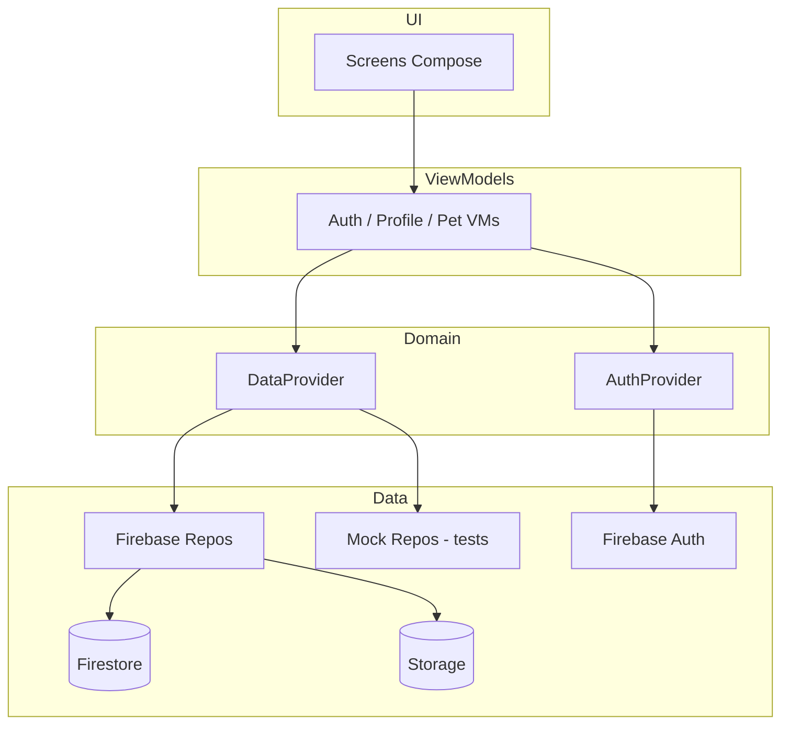
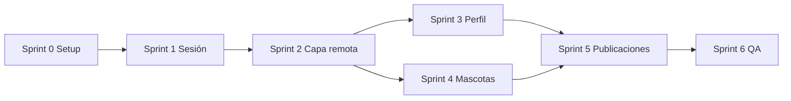

# Leover — Plan de Implementación Fase 0 (Fundación)

**Versión:** 1.0  
**Fecha:** Julio 2026  
**Duración estimada:** 4–6 semanas (1 dev)  
**Relacionado con:** [`leover-requirements.md`](leover-requirements.md), [`leover-firestore-model.md`](leover-firestore-model.md)

---

## 1. Objetivo de la Fase 0

Dejar de ser un prototipo con datos mock fijos y convertir la app en una **base real de Leover**:

- Marca Leover visible
- Sesión persistente con Firebase Auth
- Perfil de usuario real en Firestore
- CRUD de mascotas con persistencia
- Subida de imágenes a Firebase Storage
- Ubicación en perfil y publicaciones
- Selección de tipo de cuenta (roles básicos)
- Arquitectura lista para Fase 1 (feed, adopciones, perdidos en Firebase)

**No incluye Fase 0:** likes, comentarios, mapas, módulos nuevos (tránsito, eventos, directorios completos).

---

## 2. Historias de requisitos cubiertas

| ID | Historia | Fase 0 |
|----|----------|--------|
| US-F00 | Marca Leover | ✓ |
| US-F01 | Registro e inicio de sesión | ✓ (sesión persistente) |
| US-F02 | Perfil de persona | ✓ |
| US-F03 | Identidad de mascota | ✓ CRUD |
| US-F04 | Publicar con fotos | ✓ (infra + primer uso en posts) |
| US-F05 | Ubicación | ✓ (texto; sin GPS) |
| US-F06 | Roles de cuenta | ✓ (selección en registro/edición) |

---

## 3. Arquitectura objetivo al cierre de Fase 0



---

## 4. Sprints y tareas

### Sprint 0 — Setup (3–4 días)

| # | Tarea | Archivos / acción | Criterio de done |
|---|-------|-------------------|------------------|
| 0.1 | Configurar proyecto Firebase (Auth, Firestore, Storage) | Consola Firebase; verificar `google-services.json` | Proyecto creado; app Android registrada |
| 0.2 | Agregar dependencia Firebase Storage | `gradle/libs.versions.toml`, `app/build.gradle.kts` | `firebase-storage-ktx` compila |
| 0.3 | Crear reglas Firestore staging | `firestore.rules` en repo; desplegar con CLI | Reglas de `users`, `pets`, `posts` activas |
| 0.4 | Crear reglas Storage staging | `storage.rules` en repo | Solo owner escribe en su path |
| 0.5 | Documentar variables y entornos | `docs/leover-firestore-model.md` (ya existe) | Equipo sabe qué colecciones usar |

**Entregable:** Firebase listo para desarrollo.

---

### Sprint 1 — Marca y sesión (4–5 días)

| # | Tarea | Archivos / acción | Criterio de done |
|---|-------|-------------------|------------------|
| 1.1 | Renombrar marca a Leover en UI | `strings.xml`, `LoginScreen.kt`, `README.md` | Login muestra "Leover" |
| 1.2 | Actualizar textos de onboarding/tagline | `LoginScreen.kt`, `strings.xml` | Mensaje alineado a ecosistema |
| 1.3 | Splash screen (opcional v0) | `themes.xml`, `MainActivity.kt` | Logo Leover al abrir |
| 1.4 | `SessionViewModel` o lógica en `MainActivity` | Nuevo: `viewmodel/SessionViewModel.kt`, `ComunidappNavGraph.kt` | Si hay sesión Firebase → `MAIN`; si no → `LOGIN` |
| 1.5 | Observar `FirebaseAuth.authStateListener` | `FirebaseAuthRepository.kt` o `SessionRepository.kt` | Cambio de auth redirige correctamente |
| 1.6 | Pantalla de carga inicial | `ui/components/LoadingState.kt` o splash | Sin flash de login si ya logueado |
| 1.7 | Logout en perfil | `ProfileScreen.kt`, `ProfileViewModel.kt` | Botón cierra sesión y va a login |

**Archivos a modificar:**
- `app/src/main/res/values/strings.xml`
- `app/src/main/java/com/comunidapp/app/navigation/ComunidappNavGraph.kt`
- `app/src/main/java/com/comunidapp/app/ui/screens/login/LoginScreen.kt`
- `app/src/main/java/com/comunidapp/app/ui/screens/profile/ProfileScreen.kt`
- `app/src/main/java/com/comunidapp/app/viewmodel/ProfileViewModel.kt`

**Entregable:** App abre en inicio si el usuario ya inició sesión; logout funcional.

---

### Sprint 2 — Modelo de datos y capa remota (5–7 días)

| # | Tarea | Archivos / acción | Criterio de done |
|---|-------|-------------------|------------------|
| 2.1 | Agregar `AccountType` enum | `data/model/Enums.kt` | 7 tipos definidos |
| 2.2 | Extender `User` con campos Firestore | `data/model/User.kt` | `accountType`, `locationText`, `phone`, timestamps |
| 2.3 | Extender `FeedPost` (`locationText`, timestamps) | `data/model/FeedPost.kt` | Compatible mock + Firebase |
| 2.4 | Crear `FirestoreMappers.kt` | `data/remote/firestore/FirestoreMappers.kt` | `toUser()`, `toFeedPost()`, `toPet()` |
| 2.5 | `FirebaseStorageService` | `data/remote/storage/FirebaseStorageService.kt` | `uploadImage(path, uri) → Result<String>` |
| 2.6 | `UserFirestoreDataSource` | `data/remote/firestore/UserFirestoreDataSource.kt` | get, create, update user |
| 2.7 | `PetFirestoreDataSource` | `data/remote/firestore/PetFirestoreDataSource.kt` | CRUD pets |
| 2.8 | `PostFirestoreDataSource` | `data/remote/firestore/PostFirestoreDataSource.kt` | observe, add post |
| 2.9 | `DataProvider` | `data/provider/DataProvider.kt` | Switch mock/Firebase como `AuthProvider` |
| 2.10 | `UserRepository` + impl Firebase/Mock | `data/repository/UserRepository.kt` | Interface + 2 impl |
| 2.11 | Actualizar `FirebaseAuthRepository.saveUserToFirestore` | `FirebaseAuthRepository.kt` | Guarda `accountType`, `locationText` nullables |
| 2.12 | Tests unitarios de mappers | `app/src/test/.../FirestoreMappersTest.kt` | Mín. 3 tests |

**Entregable:** Capa de datos Firebase operativa y testeada en mappers.

---

### Sprint 3 — Perfil de usuario (4–5 días)

| # | Tarea | Archivos / acción | Criterio de done |
|---|-------|-------------------|------------------|
| 3.1 | `ProfileViewModel` usa usuario autenticado | `ProfileViewModel.kt` | Ya no usa `MockData.currentUser` hardcodeado |
| 3.2 | Cargar perfil desde Firestore al login | `UserRepository`, `ProfileViewModel` | Nombre, bio, foto, ubicación reales |
| 3.3 | Pantalla editar perfil | Nuevo: `ui/screens/profile/EditProfileScreen.kt` | Formulario foto, nombre, bio, ubicación, teléfono |
| 3.4 | `EditProfileViewModel` | Nuevo: `viewmodel/EditProfileViewModel.kt` | Validación + guardado |
| 3.5 | Subir avatar a Storage | `EditProfileViewModel` + `FirebaseStorageService` | URL guardada en `users/{uid}` |
| 3.6 | Selector de imagen (galería) | `ActivityResultContracts.PickVisualMedia` en EditProfile | Foto seleccionable |
| 3.7 | Ruta navegación `EDIT_PROFILE` | `NavRoutes.kt`, `ComunidappNavGraph.kt` | Acceso desde perfil |
| 3.8 | Selección `accountType` en registro o edición | `RegisterScreen.kt` o `EditProfileScreen.kt` | Dropdown con tipos de cuenta |
| 3.9 | Perfil público (vista otros usuarios) — stub | Opcional Fase 0: preparar navegación | Ruta `USER_PROFILE/{userId}` definida |

**Criterios US-F02:**
- [ ] Editar y guardar perfil
- [ ] Ver datos en pantalla perfil
- [ ] Cerrar sesión
- [ ] Avatar con foto real

**Entregable:** Perfil persistente vinculado al usuario logueado.

---

### Sprint 4 — Mascotas CRUD (5–6 días)

| # | Tarea | Archivos / acción | Criterio de done |
|---|-------|-------------------|------------------|
| 4.1 | `FirebasePetRepository` | `data/repository/PetRepository.kt` | Implementación Firestore |
| 4.2 | `PetDetailViewModel` reactivo | `PetDetailViewModel.kt` | `observePet(id)` o flow desde repo |
| 4.3 | Pantalla crear mascota | Nuevo: `ui/screens/pets/AddPetScreen.kt` | Formulario completo |
| 4.4 | Pantalla editar mascota | Nuevo: `ui/screens/pets/EditPetScreen.kt` | Pre-carga datos |
| 4.5 | `PetFormViewModel` | Nuevo: `viewmodel/PetFormViewModel.kt` | Create + update |
| 4.6 | Subir foto de mascota | `PetFormViewModel` + Storage | Path `/users/{uid}/pets/{petId}/photo.jpg` |
| 4.7 | Eliminar mascota (confirmación) | `PetDetailScreen.kt` o `EditPetScreen.kt` | Borra doc Firestore + opcional Storage |
| 4.8 | `MyPetsViewModel` con `ownerId` real | `ProfileViewModel.kt` | Lista mascotas del usuario auth |
| 4.9 | Rutas `ADD_PET`, `EDIT_PET/{petId}` | `NavRoutes.kt`, `ComunidappNavGraph.kt` | FAB o botón en Mis mascotas |
| 4.10 | Sección salud en formulario | `AddPetScreen.kt` | Vacunas como lista editable simplificada |

**Criterios US-F03:**
- [ ] Crear, editar, eliminar mascota
- [ ] Ficha salud básica
- [ ] Detalle accesible desde lista

**Entregable:** Mascotas 100% en Firestore por usuario.

---

### Sprint 5 — Publicaciones con fotos y ubicación (4–5 días)

| # | Tarea | Archivos / acción | Criterio de done |
|---|-------|-------------------|------------------|
| 5.1 | `FirebaseFeedRepository` | `data/repository/FeedRepository.kt` | `observeFeedPosts()` con listener Firestore |
| 5.2 | `PublishViewModel` usa usuario auth | `PublishViewModel.kt` | Reemplazar `MockData.currentUser` |
| 5.3 | Campo ubicación en formularios publish | `PublishForms.kt` | `locationText` opcional/obligatorio según tipo |
| 5.4 | Selector imagen en publicar general | `PublishGeneralScreen.kt` | Preview + upload |
| 5.5 | `HomeViewModel` con Firebase | `HomeViewModel.kt` | Feed desde Firestore cuando `FIREBASE_ENABLED` |
| 5.6 | Formatear fecha desde `createdAt` | `ui/components/FeedPostCard.kt` o mapper | "Hace X" o fecha localizada |
| 5.7 | Paginación básica feed (opcional) | `PostFirestoreDataSource.kt` | `limit(20)` mínimo |
| 5.8 | Migrar `PublishViewModel` adopción/perdido a auth user | `PublishViewModel.kt` | `authorId` / `publisherId` reales |
| 5.9 | Indicador carga/error en publish | `PublishForms.kt` | UX US-F04 |

**Criterios US-F04 / US-F05:**
- [ ] Foto en publicación general
- [ ] URL persistente en Storage
- [ ] Ubicación en post y perfil

**Entregable:** Feed y publicaciones persisten en Firestore con fotos.

---

### Sprint 6 — Integración, QA y deuda (3–4 días)

| # | Tarea | Archivos / acción | Criterio de done |
|---|-------|-------------------|------------------|
| 6.1 | Eliminar dependencia de `MockData.currentUser` en ViewModels | Grep en `viewmodel/` | 0 referencias en código prod |
| 6.2 | `DataProvider` usado en todos los ViewModels | ViewModels | Inyección por defecto vía provider |
| 6.3 | Manejo errores red (snackbar) | Pantallas principales | Mensaje si falla Firestore |
| 6.4 | Reglas seguridad revisadas | `firestore.rules` | Prueba manual create/read/update |
| 6.5 | Seed datos demo Firebase (script o manual) | `docs/` o script | 1 usuario demo + 2 pets + 3 posts |
| 6.6 | Actualizar README | `README.md` | Instrucciones Leover + Firebase |
| 6.7 | Prueba E2E manual checklist | Ver §6 abajo | Todos los ítems ✓ |
| 6.8 | Alinear JDK en README (17) o `compileOptions` | `build.gradle.kts` | Sin inconsistencia documentación |

**Entregable:** Fase 0 cerrada y demo-able con Firebase.

---

## 5. Orden de dependencias



**Paralelizable:** Sprint 3 (perfil) y Sprint 4 (mascotas) tras Sprint 2.

---

## 6. Checklist QA manual Fase 0

### Auth y sesión
- [ ] Registrar usuario nuevo → verificación email → login
- [ ] Cerrar app y reabrir → entra directo al inicio
- [ ] Logout → vuelve a login
- [ ] Recuperar contraseña (Firebase: link email)

### Perfil
- [ ] Editar nombre, bio, ubicación
- [ ] Subir foto de perfil → visible tras guardar y reabrir app
- [ ] Elegir tipo de cuenta (ej. PERSON, SHELTER)

### Mascotas
- [ ] Crear mascota con foto
- [ ] Ver en Mis mascotas y detalle
- [ ] Editar datos y salud
- [ ] Eliminar mascota

### Publicaciones
- [ ] Publicar post general con foto y ubicación
- [ ] Aparece en feed de inicio
- [ ] Aparece en "Mis publicaciones" del perfil
- [ ] Publicar adopción / perdido con usuario real como autor

### Modo mock (sin `google-services.json`)
- [ ] App sigue compilando y funcionando con mocks para desarrollo offline

---

## 7. Archivos nuevos previstos

```
app/src/main/java/com/comunidapp/app/
├── data/
│   ├── provider/DataProvider.kt
│   ├── remote/
│   │   ├── firestore/
│   │   │   ├── FirestoreMappers.kt
│   │   │   ├── UserFirestoreDataSource.kt
│   │   │   ├── PetFirestoreDataSource.kt
│   │   │   └── PostFirestoreDataSource.kt
│   │   └── storage/FirebaseStorageService.kt
│   └── repository/
│       ├── UserRepository.kt
│       ├── FirebaseUserRepository.kt
│       ├── FirebasePetRepository.kt
│       └── FirebaseFeedRepository.kt
├── viewmodel/
│   ├── SessionViewModel.kt
│   ├── EditProfileViewModel.kt
│   └── PetFormViewModel.kt
└── ui/screens/
    ├── profile/EditProfileScreen.kt
    └── pets/AddPetScreen.kt, EditPetScreen.kt

firestore.rules
storage.rules
app/src/test/.../FirestoreMappersTest.kt
```

---

## 8. Archivos existentes a modificar (prioridad)

| Archivo | Cambio principal |
|---------|------------------|
| `ComunidappNavGraph.kt` | Start destination dinámico; rutas edit profile, add/edit pet |
| `NavRoutes.kt` | Nuevas constantes de ruta |
| `ProfileViewModel.kt` | `UserRepository`, usuario auth |
| `PublishViewModel.kt` | Usuario auth, image upload |
| `HomeViewModel.kt` | `DataProvider.feedRepository` |
| `PetDetailViewModel.kt` | Flow reactivo |
| `ProfileScreen.kt` | Logout, editar perfil |
| `MyPetsScreen.kt` | FAB agregar mascota |
| `PublishForms.kt` | Image picker, location field |
| `User.kt`, `FeedPost.kt`, `Enums.kt` | Campos Firestore |
| `FirebaseAuthRepository.kt` | Perfil extendido al registrar |
| `app/build.gradle.kts` | `firebase-storage` |
| `strings.xml` | Marca Leover |

---

## 9. Riesgos y mitigaciones

| Riesgo | Mitigación |
|--------|------------|
| Reglas Firestore bloquean writes | Desplegar reglas temprano; probar con usuario test en Sprint 2 |
| Índices faltantes en queries | Crear índices al primer error en logcat; documentados en firestore-model |
| Upload lento en 3G | Comprimir imagen antes de subir (max 1024px lado largo) |
| Scope creep (likes, mapas) | Dejar explícito fuera de Fase 0; backlog Fase 1 |
| Mock y Firebase divergen | `DataProvider` único punto de switch; mismas interfaces |

---

## 10. Definición de terminado (Fase 0)

La Fase 0 se considera **cerrada** cuando:

1. Un usuario real puede registrarse, verificar email y usar la app sin mock de usuario fijo.
2. Perfil y mascotas persisten en Firestore/Storage.
3. Puede publicar en el feed con foto y ver su contenido tras reiniciar la app.
4. Logout y sesión persistente funcionan.
5. Modo sin Firebase (mock) sigue operativo para desarrollo local.
6. Documentación actualizada (`README`, reglas, modelo Firestore).
7. Checklist QA manual (§6) completado.

---

## 11. Siguiente paso: Fase 1 (preview)

Tras cerrar Fase 0, iniciar:

| Prioridad | Historia | Depende de |
|-----------|----------|------------|
| P0 | US-RS03, US-RS04 (likes, comentarios) | `posts` subcolecciones |
| P0 | US-PE04 (resuelto) | `lost_found.status` |
| P0 | US-AD03 (solicitud adopción) | `adoptions/requests` |
| P1 | `FirebaseAdoptionRepository`, `FirebaseLostFoundRepository` | DataProvider |
| P1 | US-RS05 personas cerca | `users.locationText` index |

---

## 12. Estimación resumida

| Sprint | Días | Acumulado |
|--------|------|-----------|
| 0 Setup | 3–4 | 4 |
| 1 Sesión + marca | 4–5 | 9 |
| 2 Capa remota | 5–7 | 16 |
| 3 Perfil | 4–5 | 21 |
| 4 Mascotas | 5–6 | 27 |
| 5 Publicaciones | 4–5 | 32 |
| 6 QA | 3–4 | **36 días máx.** |

**~4–6 semanas** calendario con 1 desarrollador a tiempo completo.

---

*Para ejecutar: marcar tareas en issues/tabla de proyecto y cerrar cada sprint con demo interna.*
